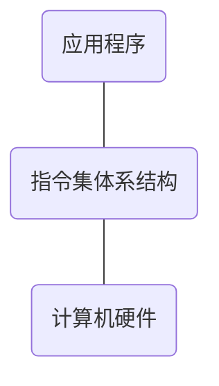
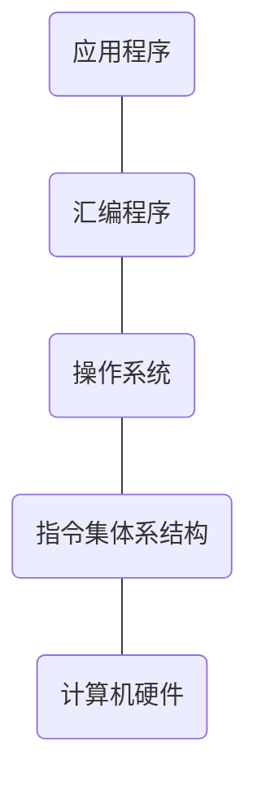
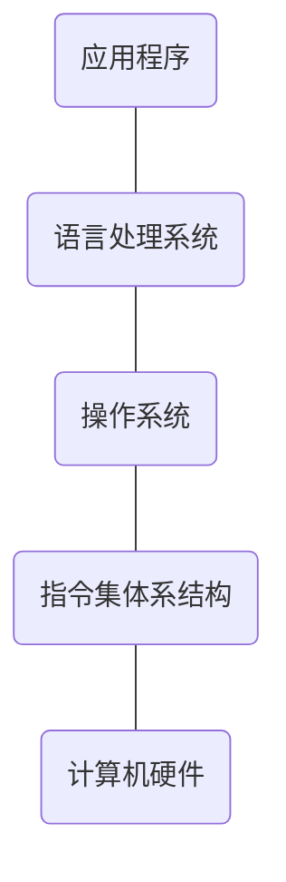

# 一、冯·诺伊曼结构

### 1. 第一台通用计算机（1946 Electronic Numerical Integrator And Computer）

1. 电子真空管组成
2. 美国宾夕法尼亚大学研制
3. 解决弹道计算问题
4. 十进制表示信息并运算
5. 手动编程，通过设置开关和插拔电缆来实现

### 2. 现代计算机的原型

1. 冯·诺依曼结构最重要的思想是：存储程序

2. 工作方式：首先将任务编写成程序，然后将程序和初始数据送入主存并启动，程序一旦启动，计算机便能在不需要操作人员干预下，自动完成逐条取出指令和执行指令

3. 几乎所有现代通用计算机都是采用的冯诺伊曼结构

### 3.冯·诺伊曼结构的主要思想

1. 计算机由运算器、控制器、存储器、输入设备、输出设备五个基本部分组成
   * 存储器：存储数据和指令，本质上二者没有区别，计算机可以区别数据和指令
   * 控制器：能自动的取出指令来执行
   * 运算器：能进行基本的算术运算、逻辑运算、附加运算
   * 输入、输出设备：操作人员与主机进行通讯的工具
2. 内部以二进制的形式表示指令和数据，每条指令由操作码和地址码两部分组成，操作码指出操作类型，地址码指出操作数的地址
3. 采用存储程序方式工作

# 二、现代计算机结构模型及工作原理

### 1. 现代计算机结构模型


* ALU：运算器，完成算数运算和逻辑运算以及附加运算
* 控制器：完成数据和指令的控制
* IR：指令寄存器，存放从存储器中读取进来的指令
* PC：程序计数器，用来存放所要读取的指令地址
* MAR：与总线相连，主存地址寄存器，用来存放指令地址
* MDR：与总线相连，主存数据寄存器，用来存放从存储器中读取的数据
* CPU和存储器之间通过总线进行数据通讯

### 2. 工作原理

* 前期准备	
  1. 将数据和指令按序存放在存储器中
  2. 初始化PC指针
* 执行过程
  1. 根据PC取指令
  2. 指令译码
  3. 取操作数
  4. 执行指令
  5. 回写结果
  6. 修改PC地址
* 总结：取指执行

# 三、机器语言到高级语言

### 1. 机器语言：由0和1序列写成的程序

```机器
0101 0110
0010 0100 
0011 1100
```

* 书写阅读困难、不灵活

### 2. 汇编语言

```汇编
add B
jc L0

L0:sub
```

* 用助记符表示操作码
* 汇编语言由汇编指令组成
  * 指令包含操作码和操作数（或操作数所在的地址码）
* 标号表示位置
* 助记符表示寄存器
* 可读性更强
* 机器无法识别，必须通过汇编程序将汇编语言编写的程序转换成机器语言编写的程序
* 程序很长，不便于移植

### 3. 高级语言

* 与具体机器无关
* 面向算法描述
* 高级语言中一条语句对应几十条或者几百条指令
* 有面向过程和面向对象之分
* 逻辑结构有以下三种
  * 顺序结构
  * 分支结构
  * 循环结构
* 有两种转换方式：编译和解释
  * 编译：将高级语言源程序转换为机器级目标程序，执行时只需启动目标程序即可
  * 解释：将高级语言指令逐条翻译成机器指令，并立即执行，不会生成目标文件

### 4. 程序开发和执行及其支撑环境

* 高级语言开发程序需要复杂的支撑环境
  * 需要编辑器编写源程序
  * 需要一套翻译转换软件处理各类源程序
    * 编译方式：预处理程序、编译器、汇编器、连接器
    * 解释方式：解释程序
  * 一个可以执行程序的环境
    * GUI方式：图形用户界面
    * CUI方式：命令行用户界面

# 四、计算机层次结构

### 1. 机器语言编程



### 2. 汇编语言程序



### 3. 高级语言程序



* 语言处理系统包括：语言处理程序和运行时系统

### 4. 计算机抽象层次结构


### 5. 指令集体系结构（ISA）

1. ISA是指Instruction Set Architecture，即指令集体系结构，简称为指令系统
2. ISA是一种规约，规定了如何使用硬件
   * 可执行的指令的集合，包括指令格式、操作种类以及每种操作对应的操作数的相应规定
   * 指令可以接受的操作数的类型
   * 操作数所能存放的寄存器组的结构，包括每个寄存器的名称、编号、长度和用途
   * 操作数所能存放的存储空间的大小和编址方式
   * 操作数在存储空间存放时按照大端还是小段存放
   * 指令获取操作数的方式，即寻址方式
   * 指令执行过程的控制方式，包括程序计数器（PC）、条件码定义等
3. ISA在通用计算机系统中是必不可少的一个抽象层

# 五、数据的表示

### 1. 定点数和浮点数

* 计算机中只有0和1，数值数据中的小数点如何表示？
  * 计算机中只能通过约定小数点的位置来表示
    * 小数点位置约定在固定位置的数称为定点数
    * 小数点位置约定为可浮动的数称为浮点数
* 定点小数用来表示浮点数的尾数部分
* 定点整数用来表示整数，分带符号整数和无符号整数
* 任何实数：X = (-1 )<sup>s</sup> * M * R<sup>E</sup>
  * S：决定X的符号
  * M：二进制定点小数，称为X的尾数
  * E：二进制定点整数，称为X的阶或指数
  * R：基数

| S | E | M |
| :---- | ----- | ----- |

### 2. 原码

* 用0表示正，1表示负，数值部分不变

  ```
  Decimal  Binary
  	0		  0000
  	1		  0001
  	2         0010
  	-0       1000
  	-1       1001
  	-2       1010
  ```

* 优点

  * 容易理解

* 缺点

  * 0的表示不唯一
  * 加减运算方式不统一
  * 需要额外对符号位进行处理，不利于硬件设计
  * 当 a < b 时，实现 a - b 较为困难

### 3. 补码(有符号数)

* 最高有效位解释为负权，即最高位为符号位

* 模运算模式：一个数与它除以“模”以后的余数相同

* 模运算的意义：可以将减法运算转换为加法运算

* 一个负数的补码等于将对应正数补码各位取反，末位加一

* 对于一串二进制数X = [X<sub>w-1</sub> ,X<sub>w-2</sub> ,.........X<sub>0</sub>]，转换为无符号十进制数的方式为
  $$
  D = -x_{w-1}2^{w-1}+\sum_{i=0}^{w-2}x_i2^i
  $$
  例如：

  ```进制转换
  [0001] = 0 * 2^3 + 0 * 2^2 + 0 * 2^1 + 1 * 2^0 = 0 + 0 + 0 + 1 = 1
  [0101] = 0 * 2^3 + 1 * 2^2 + 0 * 2^1 + 1 * 2^0 = 0 + 4 + 0 + 1 = 5
  [1101] = -1* 2^3 + 1 * 2^2 + 0 * 2^1 + 1 * 2^0 = -8 + 4 + 0 + 1 = -3
  [1111] = -1* 2^3 + 1 * 2^2 + 1 * 2^1 + 1 * 2^0 = -8 + 4 + 2 + 1 = -1
  [0000] = 0 * 2^3 + 0 * 2^2 + 0 * 2^1 + 0 * 2^0 = 0 + 0 + 0 + 0 = 0
  ```

  

### 4. 移码

* 将一个数值加上一个偏置常数

* 通常，编码位数为n时，偏置常数取2<sup>n-1</sup>或2<sup>n-1</sup>-1

  * Ex. n = 4 ：E<sub>biased</sub> = E + 2<sup>3</sup>

  ```
  - 8(+8) ~ 0000
  - 7(+8) ~ 0001
  - 8(+8) ~ 0000
  +7(+8) ~ 1111
  ```

  

* 移码便于浮点数加减运算时的对阶操作（比较大小）

### 5. 无符号数

* 对于一串二进制数X = [X<sub>w-1</sub> ,X<sub>w-2</sub> ,.........X<sub>0</sub>]，转换为无符号十进制数的方式为
  $$
  D_u = \sum_{i=0}^{w-1}x_i2^i
  $$

  例如：

  ```进制转换
  [0001] = 0 * 2^3 + 0 * 2^2 + 0 * 2^1 + 0 * 2^0 = 0 + 0 + 0 + 1 = 1
  [0101] = 0 * 2^3 + 1 * 2^2 + 0 * 2^1 + 1 * 2^0 = 0 + 4 + 0 + 1 = 5
  ```

### 6. 有符号数和无符号数的转换

* 在C语言中，有符号数与无符号数进行混合运算时，会将有符号数自动转换为无符号数，在进行转换时，保持位值不变，改变解释位值的方式

* 有符号数X转换为无符号数Y的转换公式如下
  $$
  Y =
  \begin{cases}
  \ x + 2^w , &x<0\\
  x , &x>0
  \end{cases}
  $$

* 无符号数Y转换为有符号数X的转换公式如下

    

$$
X =
\begin{cases}
\ y , & y \le MAX(X)\\
U - 2^w , & y \gt MAX(x)
\end{cases}
$$

### 7. 数据扩充

* 将一个无符号数转换为更大的数据类型，只需在开头添加0即可，称为零扩展

  例如：

  ```数据扩充
  010  -> 0010
  110  -> 0110
  ```

* 将一个有符号数转换为更大的数据类型，只需要在开头添加最高位即可，称为符号扩展

  例如：

  ```数据扩充
  011 -> 0011
  110 -> 1110
  ```

### 8.数据截断

* 对于无符号数，将一串二进制数据进行截断时，直接丢弃高位
* 对于有符号数，将一串二进制数据进行截断时，直接丢弃高位，然后将最高位按符号位进行解释

### 9. 整数计算

* 对于无符号数，如果两个数相加的的结果有溢出，将溢出位丢弃

* 无符号数求反公式如下：对于某个无符号数X，肯定存在一个数-X，使得X+（-X） = 0
  $$
  -X =
  \begin{cases}
  \ x , &x = 0\\
  2^w - x , & x > 0
  \end{cases}
  $$

### 10. 浮点数

* IEEE 754标准：制定了浮点数的表示和运算规则

* 浮点数用如下公式进行表示：
  $$
  V = (-1)^S  * M * 2^E
  $$

  * 符号S决定这是负数（s = 1）还是正数(s = 0)，对于数值0的符号位解释为特殊情况
  * 尾数M是一个二进制小数
  * 阶码E对浮点数进行加权，权重位2的E次幂

  | S    | E    | M    |
  | ---- | ---- | ---- |

* 规格化浮点数

  | S    | E!=0&E!=255 | M    |
  | ---- | ----------- | ---- |

  * 阶码字段E解释为以偏置形式表示的有符号整数，`E = e - Bias`，e为一串无符号数，Bias为2<sup>k-1</sup> -1的偏置值
  * 尾数M解释为小数值f，其中0<=f<1，尾数定义M\=1+f。

* 非规格化浮点数

  | S    | 全0  |      |
  | ---- | ---- | ---- |

  * 阶码E全为0，该情况下，阶码E \= 1 - Bias，尾数的值为M=f,
  * 提供了一种表示数值0的方法，如果使用规格化数，必须总是使M>=1,所以无法表示0。
  * 表示那些非常接近于0.0的数，提供了一种属性，称为逐渐溢出，其中，可能的数值分布均匀地接近于0.0

* 特殊值

  无穷大

  | S    | 全1  | 全0  |
  | ---- | ---- | ---- |

  NaN

  | S    | 全1  | 非0  |
  | ---- | ---- | ---- |

  * 两个非常大的数相乘或者除以0时，无穷可以表示溢出的结果
  * 小数域为非0时，结果值称为“NaN”

### 11. 数据舍入

* 向偶数舍入：将数字向上或者向下舍入，使得结果的最低有效数字是偶数。

# 六、数据格式

* 一个0或1就是一位，最基本的计量单位是字节，一个字节等于8个二进制位，存储器按照字节编址，字节也是最小的可寻址单位，一个字等于两个字节，即一个字大小为16位
* 字长：数据通路的宽度，数据通路是指CPU内部数据流经的路径以及路径上的部件，主要是CPU内部进行数据运算、存储和传送的部件，这些部件的宽度基本上要一致
* 


